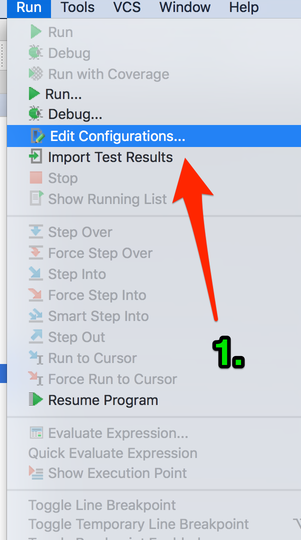
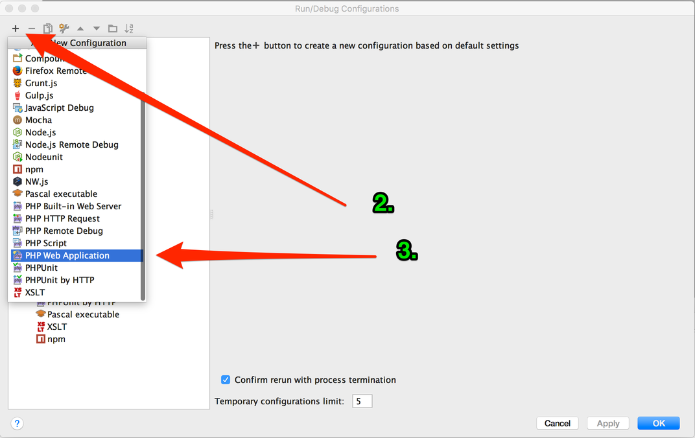
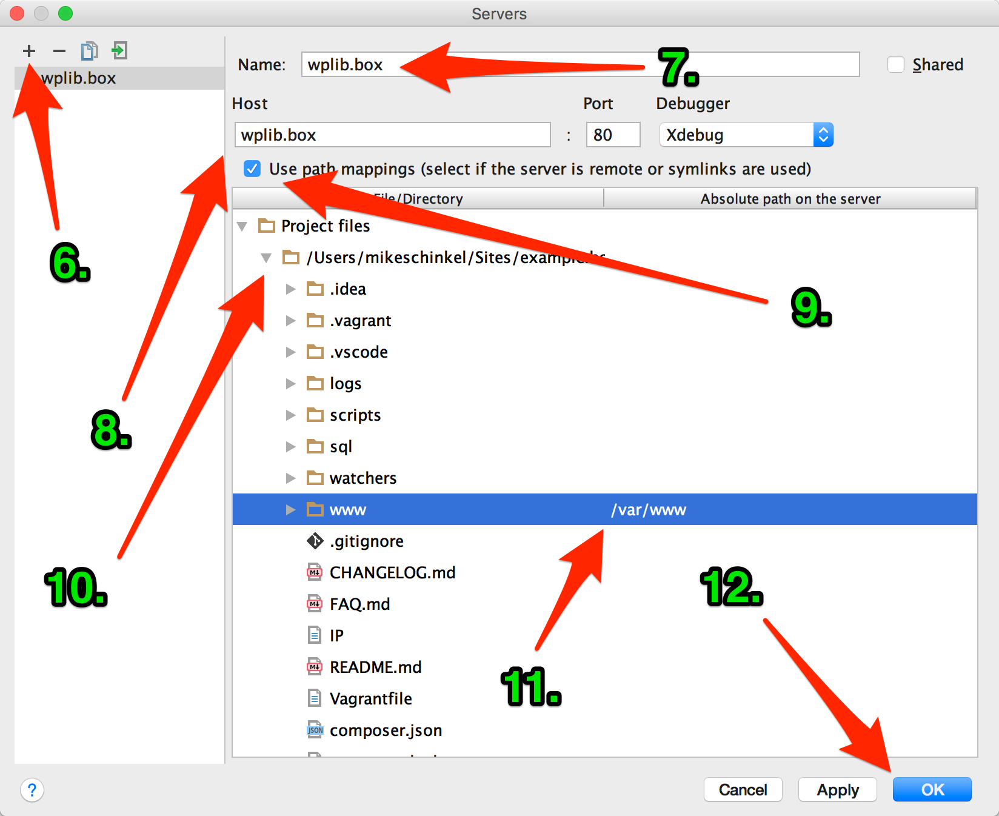
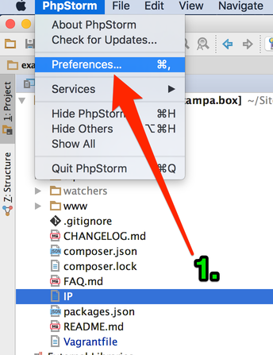
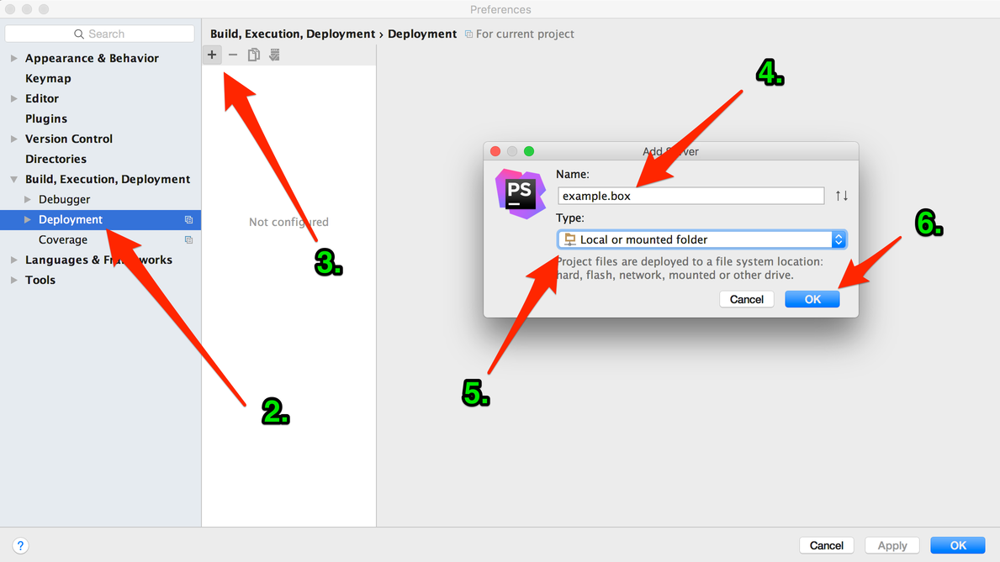
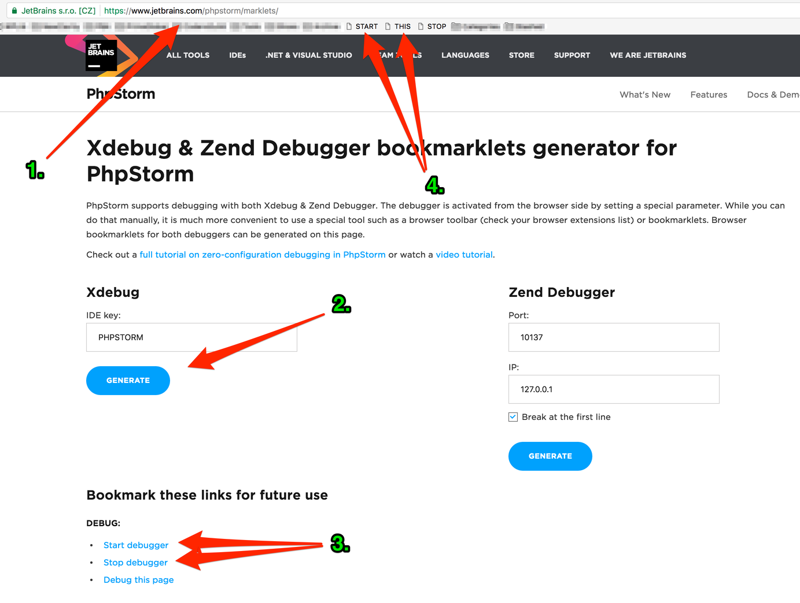
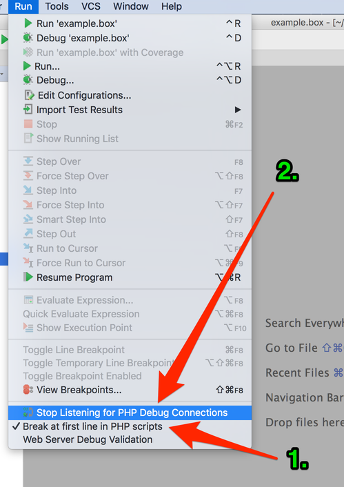

#Easy Local Development

**_For WordPress (and PHP)_**

_Presented by Mike Schinkel to Connect.Tech Atlanta October 2016_

##Debugging with PhpStorm and XDEBUG

###Run/Debug Configuration
1. `Run > Edit Configurations`

	
2. `[+]`
3. `PHP Web Application`
	
4. Name: `example.box`
5. `[...]`
	
6. `[+]`
7. Name: `wplib.box`
8. Host: `wplib.box`
9. Use Path Mappings: `[x]`
10. Expand Directory Tree
11. Map `www` => `/var/www`
12. `[Ok]`
	
13. `[Ok]`
	

###Preferences/Deployment
1. `PhpStorm > Preferences` (Mac OS X) OR `File > Settings` (Windows - _I THINK_ - Ask if not)
	

2. `Build, Execution, Deployment > Deployment`
3. `[+]`
4. Name: `example.box`
5. Type: `local or mounted folder`
6. `[Ok]`
	
7. Folder: `[...]` 
	
8. Select your `example.box` site folder/directory
9. `[Ok]`
	
10. Web Server Root URL: `http://example.box`
11. `[Mappings]` tab
	
12. Local Path: Add `/www` or `\www` to what is already there
13. Deployment Path on Server: `/`
14. `[Ok]`
	

###Add the Debugging Bookmarklets to your Browser
1. Visit [PhpStorm Bookmarklets](https://www.jetbrains.com/phpstorm/marklets/) page
2. Click `[GENERATE]` under *Xdebug*
3. Drag _"Start Debugger_" and _"Debug this Page"_ 
4. To your Browser Toolbar
	

###Enable Debugging in PhpStorm
1. `Run > Break at First Line in PHP Scripts`
2. `Run > Start Listening for PHP Debug Connections`
	

###Start Debugging
- Visit http://example.box
- Click _"Debug this Page"_
- Enjoy!
